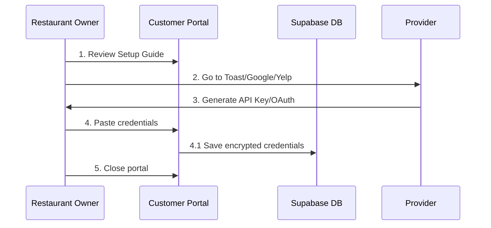
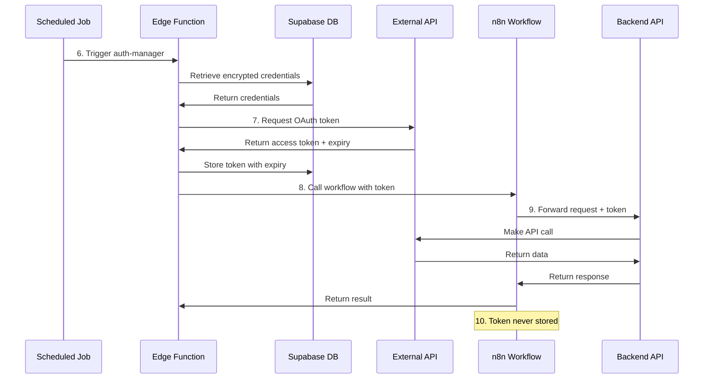
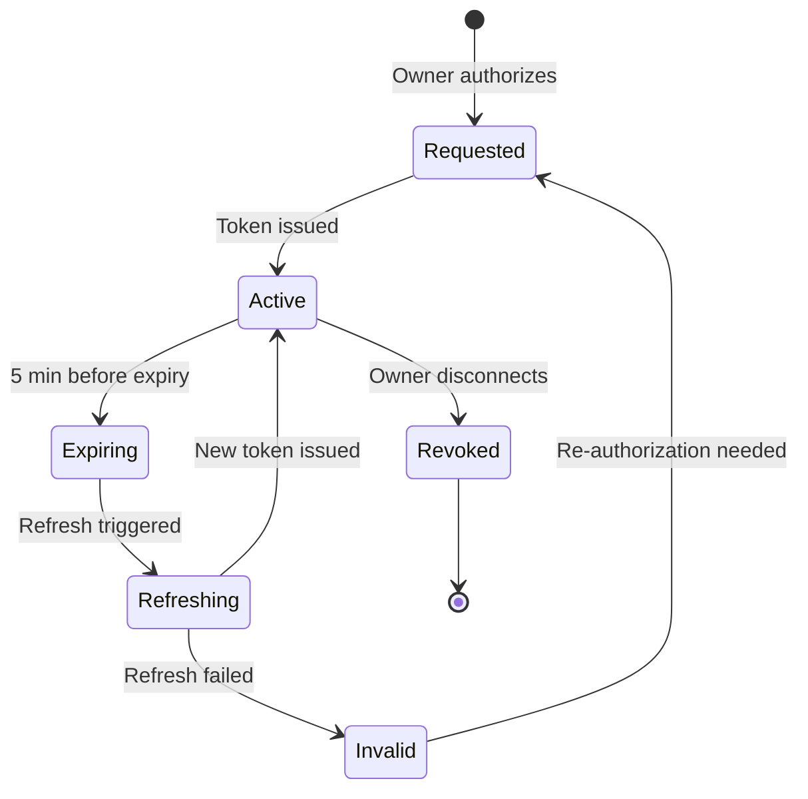

# Credential Management Architecture

**Version:** 1.0.0  
**Last Updated:** 2026-06-08  
**Audience:** NeuralTable Engineering Team  
**Classification:** Internal Technical Documentation

This document describes the internal architecture for managing restaurant owner credentials and authentication across all integrations.

---

## Table of Contents

- [Architecture Overview](#architecture-overview)
- [Data Flow](#data-flow)
- [Database Schema](#database-schema)
- [Credential Storage](#credential-storage)
- [Token Management](#token-management)
- [n8n Integration](#n8n-integration)
- [Security Implementation](#security-implementation)
- [API Endpoints](#api-endpoints)
- [Error Handling](#error-handling)
- [Monitoring & Alerts](#monitoring--alerts)

---

## Architecture Overview

### System Components

```
┌─────────────────────────────────────────────────────────────────┐
│                    Restaurant Owner                              │
│                    (Customer Portal)                             │
└────────────┬────────────────────────────────────────────────────┘
             │
             │ 1. Configure Credentials
             ↓
┌─────────────────────────────────────────────────────────────────┐
│             NeuralTable Customer Portal UI                       │
│             (customer.neuraltable.ai)                            │
└────────────┬────────────────────────────────────────────────────┘
             │
             │ 2. Save Encrypted
             ↓
┌─────────────────────────────────────────────────────────────────┐
│             Supabase Database                                    │
│             (PostgreSQL)                                         │
│                                                                  │
│  Tables:                                                         │
│  - integration_credentials                                       │
│  - oauth_tokens                                                  │
│  - api_keys                                                      │
└────────────┬────────────────────────────────────────────────────┘
             │
             │ 3. Retrieve & Refresh
             ↓
┌─────────────────────────────────────────────────────────────────┐
│             Supabase Edge Functions                              │
│             (Deno Runtime)                                       │
│                                                                  │
│  Functions:                                                      │
│  - auth-manager                                                  │
│  - token-refresher                                               │
│  - credential-validator                                          │
└────────────┬────────────────────────────────────────────────────┘
             │
             │ 4. Call with Auth Token
             ↓
┌─────────────────────────────────────────────────────────────────┐
│             n8n Workflows                                        │
│             (n8n Cloud)                                          │
│                                                                  │
│  Workflows:                                                      │
│  - toast/*, google/*, yelp/*, etc.                               │
└────────────┬────────────────────────────────────────────────────┘
             │
             │ 5. Forward to Backend APIs
             ↓
┌─────────────────────────────────────────────────────────────────┐
│             External Provider APIs                               │
│             (Toast, Google, Yelp, OpenTable, etc.)               │
└─────────────────────────────────────────────────────────────────┘
```

### Key Principles

1. **Separation of Concerns**
   - Customer Portal: UI for credential input
   - Database: Encrypted storage
   - Edge Functions: Token management and refresh
   - n8n: Workflow orchestration (no credential storage)
   - Backend APIs: Direct integration

2. **Security by Design**
   - Encrypt credentials at rest (AES-256)
   - Never log sensitive data
   - Automatic token rotation
   - Minimal credential exposure

3. **Zero Credential Storage in n8n**
   - n8n receives tokens at runtime only
   - No API keys stored in n8n workflows
   - Tokens passed via headers only
   - Immediate disposal after use

---

## Data Flow

### Restaurant Owner Flow (Steps 1-5)



### Internal NeuralTable Flow (Steps 6-10)



---

## Database Schema

### Location
`/Users/svallamkonda/Documents/GitLab/neuraltable-2/neuraltable-database`

### Tables

#### 1. `integration_credentials`

Stores encrypted API keys and OAuth credentials.

```sql
CREATE TABLE integration_credentials (
    id UUID PRIMARY KEY DEFAULT gen_random_uuid(),
    organization_id UUID NOT NULL REFERENCES organizations(id) ON DELETE CASCADE,
    integration_type VARCHAR(50) NOT NULL, -- 'toast', 'google', 'yelp', etc.
    
    -- Encrypted fields (AES-256-GCM)
    encrypted_credentials JSONB NOT NULL, -- Encrypted API keys, client secrets
    encryption_key_id UUID NOT NULL REFERENCES encryption_keys(id),
    
    -- Metadata
    environment VARCHAR(20) DEFAULT 'production', -- 'production' or 'sandbox'
    status VARCHAR(20) DEFAULT 'active', -- 'active', 'invalid', 'expired'
    last_validated_at TIMESTAMPTZ,
    
    -- Audit
    created_at TIMESTAMPTZ DEFAULT NOW(),
    updated_at TIMESTAMPTZ DEFAULT NOW(),
    created_by UUID REFERENCES users(id),
    updated_by UUID REFERENCES users(id),
    
    UNIQUE(organization_id, integration_type, environment)
);

-- Indexes
CREATE INDEX idx_integration_credentials_org ON integration_credentials(organization_id);
CREATE INDEX idx_integration_credentials_type ON integration_credentials(integration_type);
CREATE INDEX idx_integration_credentials_status ON integration_credentials(status);

-- Row Level Security
ALTER TABLE integration_credentials ENABLE ROW LEVEL SECURITY;

CREATE POLICY "Users can view own organization credentials"
    ON integration_credentials FOR SELECT
    USING (organization_id IN (
        SELECT organization_id FROM organization_members 
        WHERE user_id = auth.uid()
    ));

CREATE POLICY "Admins can manage organization credentials"
    ON integration_credentials FOR ALL
    USING (organization_id IN (
        SELECT organization_id FROM organization_members 
        WHERE user_id = auth.uid() AND role IN ('owner', 'admin')
    ));
```

#### 2. `oauth_tokens`

Stores OAuth access tokens and refresh tokens with expiry tracking.

```sql
CREATE TABLE oauth_tokens (
    id UUID PRIMARY KEY DEFAULT gen_random_uuid(),
    credential_id UUID NOT NULL REFERENCES integration_credentials(id) ON DELETE CASCADE,
    
    -- Encrypted tokens (AES-256-GCM)
    encrypted_access_token TEXT NOT NULL,
    encrypted_refresh_token TEXT,
    encryption_key_id UUID NOT NULL REFERENCES encryption_keys(id),
    
    -- Token metadata
    token_type VARCHAR(20) DEFAULT 'Bearer',
    scope TEXT[], -- OAuth scopes granted
    expires_at TIMESTAMPTZ NOT NULL,
    refresh_expires_at TIMESTAMPTZ,
    
    -- Audit
    issued_at TIMESTAMPTZ DEFAULT NOW(),
    last_refreshed_at TIMESTAMPTZ,
    refresh_count INTEGER DEFAULT 0,
    
    UNIQUE(credential_id)
);

-- Indexes
CREATE INDEX idx_oauth_tokens_credential ON oauth_tokens(credential_id);
CREATE INDEX idx_oauth_tokens_expires ON oauth_tokens(expires_at);

-- Auto-delete expired tokens (after 30 days grace period)
CREATE INDEX idx_oauth_tokens_cleanup ON oauth_tokens(expires_at) 
    WHERE expires_at < NOW() - INTERVAL '30 days';
```

#### 3. `api_keys`

Stores static API keys for services that don't use OAuth.

```sql
CREATE TABLE api_keys (
    id UUID PRIMARY KEY DEFAULT gen_random_uuid(),
    credential_id UUID NOT NULL REFERENCES integration_credentials(id) ON DELETE CASCADE,
    
    -- Encrypted API key (AES-256-GCM)
    encrypted_api_key TEXT NOT NULL,
    encryption_key_id UUID NOT NULL REFERENCES encryption_keys(id),
    
    -- Key metadata
    key_name VARCHAR(100), -- User-friendly name
    key_type VARCHAR(50), -- 'api_key', 'bearer_token', 'custom'
    permissions TEXT[], -- What the key can do
    
    -- Validation
    is_valid BOOLEAN DEFAULT true,
    last_validated_at TIMESTAMPTZ,
    validation_error TEXT,
    
    -- Audit
    created_at TIMESTAMPTZ DEFAULT NOW(),
    updated_at TIMESTAMPTZ DEFAULT NOW(),
    
    UNIQUE(credential_id)
);

-- Indexes
CREATE INDEX idx_api_keys_credential ON api_keys(credential_id);
CREATE INDEX idx_api_keys_valid ON api_keys(is_valid);
```

#### 4. `encryption_keys`

Master encryption keys for credential encryption.

```sql
CREATE TABLE encryption_keys (
    id UUID PRIMARY KEY DEFAULT gen_random_uuid(),
    key_version INTEGER NOT NULL,
    encrypted_key TEXT NOT NULL, -- Encrypted with KMS
    algorithm VARCHAR(50) DEFAULT 'AES-256-GCM',
    is_active BOOLEAN DEFAULT true,
    created_at TIMESTAMPTZ DEFAULT NOW(),
    retired_at TIMESTAMPTZ,
    
    UNIQUE(key_version)
);

-- Only one active key at a time
CREATE UNIQUE INDEX idx_encryption_keys_active ON encryption_keys(is_active) 
    WHERE is_active = true;
```

#### 5. `credential_audit_log`

Audit trail for all credential operations.

```sql
CREATE TABLE credential_audit_log (
    id UUID PRIMARY KEY DEFAULT gen_random_uuid(),
    credential_id UUID REFERENCES integration_credentials(id) ON DELETE SET NULL,
    organization_id UUID NOT NULL REFERENCES organizations(id),
    
    -- What happened
    action VARCHAR(50) NOT NULL, -- 'created', 'updated', 'deleted', 'validated', 'refreshed'
    actor_id UUID REFERENCES users(id),
    actor_ip INET,
    
    -- Context
    details JSONB,
    success BOOLEAN DEFAULT true,
    error_message TEXT,
    
    -- Timestamp
    created_at TIMESTAMPTZ DEFAULT NOW()
);

-- Indexes
CREATE INDEX idx_credential_audit_org ON credential_audit_log(organization_id);
CREATE INDEX idx_credential_audit_cred ON credential_audit_log(credential_id);
CREATE INDEX idx_credential_audit_time ON credential_audit_log(created_at DESC);

-- Partition by month for performance
CREATE TABLE credential_audit_log_2026_06 PARTITION OF credential_audit_log
    FOR VALUES FROM ('2026-06-01') TO ('2026-07-01');
```

---

## Credential Storage

### Encryption Strategy

#### AES-256-GCM Encryption

```typescript
// Example: Encrypt credentials before storage
import { createCipheriv, randomBytes } from 'crypto';

interface EncryptedData {
  encrypted: string;
  iv: string;
  authTag: string;
  keyId: string;
}

async function encryptCredential(
  plaintext: string,
  encryptionKeyId: string
): Promise<EncryptedData> {
  // Get encryption key from KMS
  const masterKey = await getEncryptionKey(encryptionKeyId);
  
  // Generate random IV
  const iv = randomBytes(16);
  
  // Create cipher
  const cipher = createCipheriv('aes-256-gcm', masterKey, iv);
  
  // Encrypt
  let encrypted = cipher.update(plaintext, 'utf8', 'hex');
  encrypted += cipher.final('hex');
  
  // Get auth tag
  const authTag = cipher.getAuthTag();
  
  return {
    encrypted,
    iv: iv.toString('hex'),
    authTag: authTag.toString('hex'),
    keyId: encryptionKeyId
  };
}
```

#### Key Management

1. **Master Keys**
   - Stored in Google Cloud KMS or AWS KMS
   - Rotated every 90 days
   - Previous keys retained for decryption

2. **Key Hierarchy**
   ```
   KMS Master Key (Cloud Provider)
        ↓
   Data Encryption Key (DEK) - Encrypted by KMS
        ↓
   Individual Credentials - Encrypted by DEK
   ```

3. **Key Rotation Process**
   - New DEK generated every 90 days
   - Old credentials re-encrypted with new key
   - Old keys marked as retired, not deleted
   - 30-day grace period before key deletion

---

## Token Management

### OAuth Token Lifecycle



### Token Refresh Strategy

#### Edge Function: `token-refresher`

```typescript
// Supabase Edge Function: functions/token-refresher/index.ts
import { serve } from 'https://deno.land/std@0.168.0/http/server.ts';
import { createClient } from 'https://esm.sh/@supabase/supabase-js@2';

serve(async (req) => {
  const supabase = createClient(
    Deno.env.get('SUPABASE_URL')!,
    Deno.env.get('SUPABASE_SERVICE_ROLE_KEY')!
  );
  
  // Find tokens expiring in next 5 minutes
  const { data: expiringTokens } = await supabase
    .from('oauth_tokens')
    .select(`
      id,
      encrypted_refresh_token,
      credential_id,
      integration_credentials (
        integration_type,
        encrypted_credentials
      )
    `)
    .lt('expires_at', new Date(Date.now() + 5 * 60 * 1000).toISOString())
    .eq('integration_credentials.status', 'active');
  
  for (const token of expiringTokens || []) {
    try {
      // Decrypt refresh token
      const refreshToken = await decryptToken(token.encrypted_refresh_token);
      
      // Refresh based on provider
      const newToken = await refreshProviderToken(
        token.integration_credentials.integration_type,
        refreshToken
      );
      
      // Encrypt and store new token
      const encryptedToken = await encryptToken(newToken.access_token);
      const encryptedRefresh = await encryptToken(newToken.refresh_token);
      
      await supabase
        .from('oauth_tokens')
        .update({
          encrypted_access_token: encryptedToken,
          encrypted_refresh_token: encryptedRefresh,
          expires_at: new Date(Date.now() + newToken.expires_in * 1000),
          last_refreshed_at: new Date(),
          refresh_count: token.refresh_count + 1
        })
        .eq('id', token.id);
        
      console.log(`✅ Refreshed token for ${token.integration_credentials.integration_type}`);
    } catch (error) {
      console.error(`❌ Failed to refresh token:`, error);
      
      // Mark token as invalid
      await supabase
        .from('oauth_tokens')
        .update({ 
          is_valid: false,
          validation_error: error.message 
        })
        .eq('id', token.id);
      
      // Notify user to re-authorize
      await sendReauthorizationEmail(token.credential_id);
    }
  }
  
  return new Response(JSON.stringify({ success: true }), {
    headers: { 'Content-Type': 'application/json' }
  });
});
```

#### Scheduled Job

```sql
-- Run token-refresher every 1 minute
SELECT cron.schedule(
  'token-refresh',
  '* * * * *', -- Every minute
  $$
    SELECT net.http_post(
      url := 'https://your-project.supabase.co/functions/v1/token-refresher',
      headers := jsonb_build_object('Authorization', 'Bearer ' || current_setting('app.service_role_key'))
    );
  $$
);
```

---

## n8n Integration

### Authentication Flow

#### Edge Function: `auth-manager`

```typescript
// Supabase Edge Function: functions/auth-manager/index.ts
import { serve } from 'https://deno.land/std@0.168.0/http/server.ts';

serve(async (req) => {
  const { organization_id, integration_type, workflow_name } = await req.json();
  
  // Get credentials from database
  const credentials = await getCredentials(organization_id, integration_type);
  
  // Get or refresh token
  const token = await getValidToken(credentials.id);
  
  // Call n8n workflow with token
  const n8nResponse = await fetch(
    `${Deno.env.get('N8N_WEBHOOK_URL')}/${workflow_name}`,
    {
      method: 'POST',
      headers: {
        'X-N8N-API-Key': Deno.env.get('N8N_WEBHOOK_KEY')!,
        'Authorization': `Bearer ${token.access_token}`,
        'Content-Type': 'application/json'
      },
      body: JSON.stringify({
        organizationId: organization_id,
        integrationType: integration_type,
        // Additional context
      })
    }
  );
  
  // Note: Token is passed only in headers, never stored in n8n
  
  return new Response(
    JSON.stringify(await n8nResponse.json()),
    { headers: { 'Content-Type': 'application/json' } }
  );
});
```

### n8n Workflow Configuration

#### Toast POS Example

```json
{
  "nodes": [
    {
      "name": "Webhook Trigger",
      "type": "n8n-nodes-base.webhook",
      "parameters": {
        "path": "toast/orders",
        "authentication": "headerAuth",
        "credentials": {
          "httpHeaderAuth": {
            "name": "N8N-WEBHOOK-KEY"
          }
        }
      }
    },
    {
      "name": "Extract Token",
      "type": "n8n-nodes-base.set",
      "parameters": {
        "values": {
          "string": [
            {
              "name": "authToken",
              "value": "={{ $json.headers.authorization }}"
            }
          ]
        }
      }
    },
    {
      "name": "Forward to Toast API",
      "type": "n8n-nodes-base.httpRequest",
      "parameters": {
        "url": "https://api.toasttab.com/orders",
        "authentication": "none",
        "sendHeaders": true,
        "headerParameters": {
          "parameters": [
            {
              "name": "Authorization",
              "value": "={{ $('Extract Token').item.json.authToken }}"
            }
          ]
        }
      }
    }
  ]
}
```

**Important:** The token flows through the workflow but is NEVER stored in:
- n8n workflow JSON
- n8n execution history
- n8n variables
- n8n environment

---

## Security Implementation

### Defense in Depth

1. **Layer 1: Portal Authentication**
   - Supabase Auth (email + password or OAuth)
   - MFA required for admin roles
   - Session timeout: 30 minutes idle

2. **Layer 2: Database Encryption**
   - AES-256-GCM for credentials
   - KMS for key management
   - Row Level Security (RLS)

3. **Layer 3: API Security**
   - Edge Functions: JWT validation
   - n8n: Header authentication
   - Rate limiting on all endpoints

4. **Layer 4: Network Security**
   - TLS 1.3 for all connections
   - Private networking between services
   - WAF for DDoS protection

### Credential Access Audit

```typescript
// Log every credential access
async function auditCredentialAccess(
  credentialId: string,
  action: string,
  actorId: string,
  success: boolean,
  details?: any
) {
  await supabase.from('credential_audit_log').insert({
    credential_id: credentialId,
    organization_id: await getOrgId(credentialId),
    action,
    actor_id: actorId,
    actor_ip: await getRequestIP(),
    details,
    success,
    created_at: new Date()
  });
}

// Example usage
await auditCredentialAccess(
  credId,
  'token_refreshed',
  'system',
  true,
  { provider: 'google', expires_at: new Date() }
);
```

---

## API Endpoints

### Customer Portal API

#### Save Credentials

```
POST /api/integrations/credentials
Authorization: Bearer {user_jwt}

Request:
{
  "integration_type": "toast",
  "environment": "production",
  "credentials": {
    "api_key": "...",
    "restaurant_guid": "..."
  }
}

Response:
{
  "success": true,
  "credential_id": "uuid",
  "status": "validating",
  "message": "Credentials saved and validation in progress"
}
```

#### Test Connection

```
POST /api/integrations/test
Authorization: Bearer {user_jwt}

Request:
{
  "integration_type": "google",
  "credential_id": "uuid"
}

Response:
{
  "success": true,
  "status": "connected",
  "details": {
    "location_name": "Restaurant ABC",
    "permissions": ["reviews.read", "reviews.write"]
  }
}
```

### Internal Edge Functions

#### Get Token for n8n

```
POST /functions/v1/auth-manager
Authorization: Bearer {service_role_key}

Request:
{
  "organization_id": "uuid",
  "integration_type": "toast",
  "workflow_name": "get-toast-orders"
}

Response:
{
  "success": true,
  "workflow_response": {...}
}

Note: Token is not returned, it's used internally
```

---

## Error Handling

### Error Types

```typescript
enum CredentialErrorType {
  // Configuration errors
  INVALID_CREDENTIALS = 'invalid_credentials',
  MISSING_PERMISSIONS = 'missing_permissions',
  EXPIRED_TOKEN = 'expired_token',
  
  // Runtime errors
  TOKEN_REFRESH_FAILED = 'token_refresh_failed',
  API_CONNECTION_ERROR = 'api_connection_error',
  RATE_LIMIT_EXCEEDED = 'rate_limit_exceeded',
  
  // Security errors
  UNAUTHORIZED_ACCESS = 'unauthorized_access',
  ENCRYPTION_FAILED = 'encryption_failed',
  DECRYPTION_FAILED = 'decryption_failed'
}
```

### Error Response Format

```typescript
interface ErrorResponse {
  success: false;
  error: {
    type: CredentialErrorType;
    message: string;
    details?: any;
    remedy?: string; // User-friendly fix
  };
  timestamp: string;
  request_id: string;
}
```

### Retry Logic

```typescript
async function callWithRetry<T>(
  fn: () => Promise<T>,
  maxRetries: number = 3,
  backoffMs: number = 1000
): Promise<T> {
  for (let i = 0; i < maxRetries; i++) {
    try {
      return await fn();
    } catch (error) {
      if (i === maxRetries - 1) throw error;
      
      // Exponential backoff
      await new Promise(resolve => 
        setTimeout(resolve, backoffMs * Math.pow(2, i))
      );
    }
  }
  throw new Error('Max retries exceeded');
}
```

---

## Monitoring & Alerts

### Metrics to Track

```typescript
// DataDog/Prometheus metrics
const metrics = {
  // Token health
  'token.refresh.success': counter,
  'token.refresh.failure': counter,
  'token.expires_soon': gauge, // Count of tokens expiring in 5 min
  
  // Credential health
  'credentials.validation.success': counter,
  'credentials.validation.failure': counter,
  'credentials.invalid_count': gauge,
  
  // Performance
  'api.response_time': histogram,
  'workflow.execution_time': histogram,
  
  // Security
  'auth.failed_attempts': counter,
  'encryption.failures': counter
};
```

### Alert Rules

```yaml
# Alert when token refresh fails repeatedly
- alert: TokenRefreshFailures
  expr: rate(token_refresh_failure[5m]) > 0.1
  for: 5m
  labels:
    severity: critical
  annotations:
    summary: "High rate of token refresh failures"
    description: "{{ $value }} token refresh failures in last 5 minutes"

# Alert when credentials become invalid
- alert: InvalidCredentials
  expr: credentials_invalid_count > 0
  for: 1m
  labels:
    severity: warning
  annotations:
    summary: "Invalid credentials detected"
    description: "{{ $value }} credentials are invalid"

# Alert on encryption failures
- alert: EncryptionFailures
  expr: rate(encryption_failures[1m]) > 0
  for: 1m
  labels:
    severity: critical
  annotations:
    summary: "Encryption system failing"
    description: "Encryption failures detected - immediate attention required"
```

### Dashboard Widgets

```typescript
// Grafana dashboard configuration
const dashboard = {
  title: 'Credential Management',
  panels: [
    {
      title: 'Token Refresh Success Rate',
      targets: [
        'rate(token_refresh_success[5m]) / rate(token_refresh_total[5m])'
      ],
      type: 'graph'
    },
    {
      title: 'Credentials by Status',
      targets: [
        'sum(credentials_count) by (status)'
      ],
      type: 'pie'
    },
    {
      title: 'API Response Times',
      targets: [
        'histogram_quantile(0.95, rate(api_response_time_bucket[5m]))'
      ],
      type: 'graph'
    }
  ]
};
```

---

## Deployment Checklist

### Initial Setup

- [ ] Configure KMS for encryption keys
- [ ] Create database tables and indexes
- [ ] Deploy Edge Functions
- [ ] Set up scheduled jobs (cron)
- [ ] Configure monitoring and alerts
- [ ] Set up log aggregation
- [ ] Test all integrations
- [ ] Load test authentication flow
- [ ] Security audit
- [ ] Document runbooks

### Per-Integration Checklist

- [ ] Create provider app/credentials
- [ ] Configure OAuth redirect URIs
- [ ] Test authorization flow
- [ ] Test token refresh
- [ ] Test API calls with n8n
- [ ] Set up monitoring
- [ ] Document for restaurant owners
- [ ] Train support team

---

## Runbooks

### Token Refresh Failure

**Symptom:** Alert "TokenRefreshFailures" firing

**Steps:**
1. Check Edge Function logs for errors
2. Verify provider API status
3. Check if credentials are expired
4. Attempt manual token refresh
5. If refresh succeeds: investigate timing issue
6. If refresh fails: notify affected organizations
7. Guide users to re-authorize

### Invalid Credentials Alert

**Symptom:** Alert "InvalidCredentials" firing

**Steps:**
1. Identify affected organizations
2. Check credential_audit_log for recent changes
3. Attempt validation
4. If validation fails:
   - Send email to organization admins
   - Provide re-authorization link
5. Monitor for resolution

### Encryption System Failure

**Symptom:** Alert "EncryptionFailures" firing

**Steps:**
1. **CRITICAL:** Stop all credential operations immediately
2. Check KMS service health
3. Verify encryption keys are accessible
4. Test encryption/decryption manually
5. If KMS issue: escalate to cloud provider
6. If key rotation issue: rollback to previous key
7. Resume operations only after verification
8. Post-mortem required

---

## Appendix

### Provider-Specific Notes

#### Toast POS
- Static API key
- No token refresh needed
- Validate by calling `/config/v2/restaurants`
- Rate limit: 1000 requests/minute

#### Google Business Profile
- OAuth 2.0
- Refresh token valid for 6 months
- Requires `https://www.googleapis.com/auth/business.manage` scope
- Rate limit: 100 requests/100 seconds

#### Yelp
- Static API key (Fusion API)
- OAuth for Partner API (review replies)
- Validate by calling `/v3/businesses/{id}`
- Rate limit: 5000 requests/day

#### OpenTable
- OAuth 2.0 (Client Credentials)
- Access token expires every 3600 seconds
- Must refresh before expiry
- Rate limit: Varies by agreement

#### Resy
- Custom header authentication
- Static API key
- Format: `Authorization: ResyAPI api_key="..."`
- Rate limit: Varies by agreement

#### Instagram
- OAuth 2.0 via Facebook
- Long-lived access tokens (60 days)
- Can exchange short for long-lived
- Rate limit: 200 calls/hour

#### Facebook
- OAuth 2.0
- Page access tokens (60 days default)
- Can extend to never expire
- Rate limit: 200 calls/hour per user

---

## References

- [Supabase Database Schema](/Users/svallamkonda/Documents/GitLab/neuraltable-2/neuraltable-database)
- [n8n Workflows](../)
- [Restaurant Owner Setup Guide](../guides/RESTAURANT-OWNER-SETUP-GUIDE.md)
- [Authentication Guide](./AUTHENTICATION-GUIDE.md)

---

**Document Owner:** NeuralTable Engineering Team  
**Last Updated:** 2026-06-08  
**Version:** 1.0.0  
**Classification:** Internal Only

**Questions?** Slack: #neuraltable-engineering
