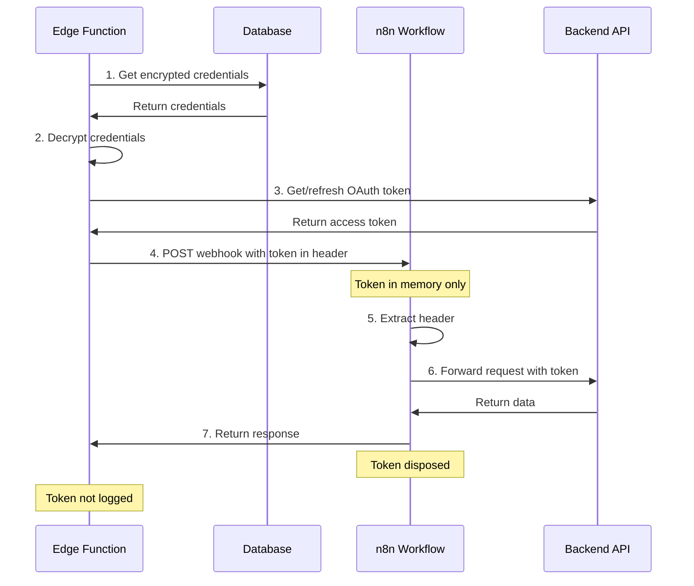

# n8n Zero Credential Storage Architecture

**Version:** 1.0.0  
**Last Updated:** 2026-06-08  
**Status:** Enforced  
**Audience:** NeuralTable Engineering Team

This document explains how n8n workflows are designed with **zero credential storage** - a critical security principle where n8n NEVER stores API keys, OAuth tokens, or any sensitive credentials.

---

## Core Principle

```
🚫 n8n NEVER stores credentials
✅ n8n receives credentials at runtime only
✅ Credentials passed via HTTP headers
✅ Immediate disposal after API call
✅ No persistence in workflow JSON, execution history, or variables
```

---

## How It Works

### Traditional (Insecure) Approach ❌

```
┌─────────────────────────────────────┐
│  n8n Workflow (BAD)                 │
│                                     │
│  credentials: {                     │
│    apiKey: "hardcoded_secret_key"  │  ← NEVER DO THIS
│  }                                  │
└─────────────────────────────────────┘
```

**Problems:**
- Credentials stored in workflow JSON
- Visible in execution history
- Accessible to all n8n users
- Risk of accidental exposure
- No automatic rotation

### NeuralTable Architecture (Secure) ✅

```
┌──────────────────────────────────────────────────────────┐
│  Edge Function (auth-manager)                            │
│  • Retrieves encrypted credentials from database         │
│  • Gets/refreshes OAuth token                            │
│  • Calls n8n workflow with token in header              │
└────────────────────┬─────────────────────────────────────┘
                     │
                     │ Headers:
                     │   X-N8N-API-Key: {webhook_key}
                     │   Authorization: Bearer {runtime_token}
                     ↓
┌──────────────────────────────────────────────────────────┐
│  n8n Workflow                                            │
│  1. Webhook receives request with headers               │
│  2. Extract token: $json.headers.authorization          │
│  3. Forward to API with token                           │
│  4. Return response                                     │
│  5. Token disposed (not stored anywhere)                │
└──────────────────────────────────────────────────────────┘
```

**Benefits:**
- ✅ No credentials in workflow JSON
- ✅ No credentials in execution history
- ✅ Automatic token rotation
- ✅ Centralized credential management
- ✅ Audit trail in database
- ✅ Revocation capability

---

## Workflow Structure

### 1. Webhook Trigger Node

```json
{
  "name": "Webhook Trigger",
  "type": "n8n-nodes-base.webhook",
  "parameters": {
    "path": "toast/orders",
    "httpMethod": "POST",
    "authentication": "headerAuth"
  },
  "credentials": {
    "httpHeaderAuth": {
      "name": "N8N-WEBHOOK-KEY"  // Only validates webhook caller
    }
  }
}
```

**Key Points:**
- `authentication: "headerAuth"` - Validates webhook caller (Edge Function)
- `credentials.httpHeaderAuth` - Only for webhook authentication, NOT for backend APIs
- Credential name is just an identifier, not the actual secret

### 2. Header Validation Node

```json
{
  "name": "Validate Required Headers",
  "type": "n8n-nodes-base.if",
  "parameters": {
    "conditions": {
      "conditions": [
        {
          "leftValue": "={{ $json.headers.authorization }}",
          "operator": { "type": "string", "operation": "isNotEmpty" }
        }
      ]
    }
  }
}
```

**Key Points:**
- Validates that Authorization header is present
- Does NOT store the header value
- Fails fast if credentials missing

### 3. Header Extraction Node (Optional)

```json
{
  "name": "Extract Headers",
  "type": "n8n-nodes-base.set",
  "parameters": {
    "values": {
      "string": [
        {
          "name": "authToken",
          "value": "={{ $json.headers.authorization }}"
        }
      ]
    }
  }
}
```

**Key Points:**
- Extracts header into variable for easier reference
- Variable exists ONLY during workflow execution
- Automatically cleared after execution completes
- NOT persisted to database or execution history

### 4. API Call Node

```json
{
  "name": "Forward to Backend API",
  "type": "n8n-nodes-base.httpRequest",
  "parameters": {
    "url": "https://api.provider.com/endpoint",
    "authentication": "none",  // Important: no built-in auth
    "sendHeaders": true,
    "headerParameters": {
      "parameters": [
        {
          "name": "Authorization",
          "value": "={{ $json.headers.authorization }}"  // Runtime value
        }
      ]
    }
  }
}
```

**Key Points:**
- `authentication: "none"` - No n8n credential manager used
- Headers populated from incoming request
- Token flows through but is not stored
- Expression `={{ $json.headers.authorization }}` evaluates at runtime

### 5. Response Node

```json
{
  "name": "Respond to Webhook",
  "type": "n8n-nodes-base.respondToWebhook",
  "parameters": {
    "respondWith": "allIncomingItems"
  }
}
```

**Key Points:**
- Returns API response to caller
- Does not persist credentials in response
- Execution history may contain response data, but NOT credentials

---

## Security Verification Checklist

### ✅ Workflow JSON Review

Check each workflow JSON file for:

- [ ] No hardcoded API keys in `parameters`
- [ ] No hardcoded tokens in `parameters`
- [ ] No OAuth credentials in `credentials` section (except webhook auth)
- [ ] Authentication set to `"none"` on HTTP Request nodes
- [ ] Headers populated from `$json.headers.*` expressions
- [ ] No `staticData` containing credentials

### ✅ n8n Credential Manager

Check n8n UI for:

- [ ] Only `N8N-WEBHOOK-KEY` credential exists (for webhook auth)
- [ ] No Toast API credentials
- [ ] No Google OAuth credentials
- [ ] No Yelp API credentials
- [ ] No OpenTable credentials
- [ ] No Resy credentials
- [ ] No Instagram/Facebook tokens

### ✅ Execution History

Check n8n execution history for:

- [ ] Authorization headers should appear as `[REDACTED]` or similar
- [ ] No plain-text API keys visible
- [ ] No OAuth tokens visible
- [ ] Response data may be visible (expected)

### ✅ Edge Function Integration

Verify Edge Function behavior:

- [ ] Token retrieved from database
- [ ] Token passed in Authorization header
- [ ] Token NOT logged in Edge Function
- [ ] Token NOT returned in response
- [ ] Token disposed after n8n call

---

## What Gets Stored Where

| Data Type | n8n Workflow JSON | n8n Execution History | n8n Variables | Database |
|-----------|-------------------|----------------------|---------------|----------|
| **Webhook Auth Key** | ✅ Reference only | ❌ Never | ❌ Never | ✅ Encrypted |
| **API Keys** | ❌ Never | ❌ Never | ❌ Never | ✅ Encrypted |
| **OAuth Tokens** | ❌ Never | ❌ Never | ❌ Never | ✅ Encrypted |
| **Request Headers** | ❌ Never | ⚠️ Redacted | ✅ Runtime only | ❌ Never |
| **API Responses** | ❌ Never | ✅ Yes | ✅ Runtime only | ✅ Yes |
| **Restaurant Data** | ❌ Never | ✅ Yes | ✅ Runtime only | ✅ Yes |

**Legend:**
- ✅ Stored (intended)
- ❌ Never stored (enforced)
- ⚠️ Redacted (security measure)
- ✅ Runtime only (temporary, cleared after execution)

---

## Runtime Token Flow

### Sequence Diagram



### Token Lifecycle

```
Token Created (Edge Function)
    ↓
Token in HTTP Request Headers (in transit)
    ↓
Token in n8n Memory (during execution)
    ↓
Token in API Request Headers (forwarded)
    ↓
Token Disposed (execution ends)

Total Lifetime: < 5 seconds
Storage Duration: 0 seconds
```

---

## Examples

### Example 1: Toast POS Order

**Edge Function Call:**
```typescript
const response = await fetch('https://n8n.cloud/webhook/toast/orders', {
  method: 'POST',
  headers: {
    'X-N8N-API-Key': process.env.N8N_WEBHOOK_KEY,
    'Authorization': `Bearer ${toastApiKey}`,  // Retrieved from DB
    'Toast-Restaurant-External-ID': restaurantGuid,
    'Content-Type': 'application/json'
  },
  body: JSON.stringify(orderData)
});
```

**n8n Workflow:**
```json
{
  "name": "Forward to Toast API",
  "parameters": {
    "url": "https://api.toasttab.com/orders/v2",
    "authentication": "none",
    "headerParameters": {
      "parameters": [
        {
          "name": "Authorization",
          "value": "={{ $json.headers.authorization }}"  // Runtime
        },
        {
          "name": "Toast-Restaurant-External-ID",
          "value": "={{ $json.headers['toast-restaurant-external-id'] }}"
        }
      ]
    }
  }
}
```

**Result:**
- ✅ Toast API key never stored in n8n
- ✅ Restaurant GUID never stored in n8n
- ✅ Token flowed through in < 2 seconds
- ✅ Execution history shows API response, not credentials

### Example 2: Google OAuth

**Edge Function Call:**
```typescript
// Get valid OAuth token (auto-refresh if expired)
const oauthToken = await getValidGoogleToken(orgId);

const response = await fetch('https://n8n.cloud/webhook/google/reviews', {
  method: 'GET',
  headers: {
    'X-N8N-API-Key': process.env.N8N_WEBHOOK_KEY,
    'Authorization': `Bearer ${oauthToken.access_token}`,  // From DB
    'Content-Type': 'application/json'
  }
});
```

**n8n Workflow:**
```json
{
  "name": "Forward to Google API",
  "parameters": {
    "url": "https://mybusiness.googleapis.com/v1/locations/{{ $json.query.locationId }}/reviews",
    "authentication": "none",
    "headerParameters": {
      "parameters": [
        {
          "name": "Authorization",
          "value": "={{ $json.headers.authorization }}"  // Runtime
        }
      ]
    }
  }
}
```

**Result:**
- ✅ OAuth token never stored in n8n
- ✅ Token automatically refreshed before call
- ✅ No Google credentials in workflow JSON
- ✅ Token valid for 1 hour, but only used for < 3 seconds

---

## Anti-Patterns (What NOT to Do)

### ❌ Anti-Pattern 1: Hardcoded Credentials

```json
// NEVER DO THIS
{
  "name": "Call API",
  "parameters": {
    "url": "https://api.provider.com",
    "headerParameters": {
      "parameters": [
        {
          "name": "Authorization",
          "value": "Bearer sk_live_abc123xyz"  // WRONG: Hardcoded token
        }
      ]
    }
  }
}
```

**Why Wrong:**
- Token visible in workflow JSON
- Token visible in Git history
- No rotation capability
- Risk of accidental exposure

### ❌ Anti-Pattern 2: Using n8n Credential Manager

```json
// NEVER DO THIS
{
  "name": "Call API",
  "type": "n8n-nodes-base.httpRequest",
  "credentials": {
    "httpHeaderAuth": {
      "name": "Toast-API-Key"  // WRONG: Credential stored in n8n
    }
  }
}
```

**Why Wrong:**
- Credentials stored in n8n database
- Accessible to all n8n users
- No centralized management
- No audit trail

### ❌ Anti-Pattern 3: Environment Variables

```json
// NEVER DO THIS
{
  "name": "Call API",
  "parameters": {
    "headerParameters": {
      "parameters": [
        {
          "name": "Authorization",
          "value": "={{ $env.TOAST_API_KEY }}"  // WRONG: Env var
        }
      ]
    }
  }
}
```

**Why Wrong:**
- Static credentials (no rotation)
- Shared across all organizations
- No per-restaurant credentials
- Difficult to revoke

### ❌ Anti-Pattern 4: Storing in Variables

```json
// NEVER DO THIS
{
  "name": "Set API Key",
  "type": "n8n-nodes-base.set",
  "parameters": {
    "values": {
      "string": [
        {
          "name": "apiKey",
          "value": "sk_live_abc123"  // WRONG: Hardcoded
        }
      ]
    }
  }
}
```

**Why Wrong:**
- Credential hardcoded in workflow
- Visible in execution history
- No rotation mechanism

---

## Correct Pattern ✅

```json
{
  "name": "Extract Runtime Token",
  "type": "n8n-nodes-base.set",
  "parameters": {
    "values": {
      "string": [
        {
          "name": "authToken",
          "value": "={{ $json.headers.authorization }}"  // ✅ Runtime value
        }
      ]
    }
  }
}
```

**Why Correct:**
- Token from incoming request
- Exists only during execution
- Auto-disposed after completion
- Centrally managed in database

---

## Monitoring & Compliance

### Automated Checks

```typescript
// Example: CI/CD check for hardcoded credentials
async function validateWorkflowSecurity(workflowJson: any) {
  const issues: string[] = [];
  
  // Check for hardcoded tokens
  const jsonString = JSON.stringify(workflowJson);
  if (/Bearer [a-zA-Z0-9_-]{20,}/.test(jsonString)) {
    issues.push('Hardcoded Bearer token detected');
  }
  
  // Check for API keys
  if (/api[_-]?key.*['":].*[a-zA-Z0-9]{20,}/.test(jsonString)) {
    issues.push('Hardcoded API key detected');
  }
  
  // Check for OAuth tokens
  if (/oauth[_-]?token.*['":].*[a-zA-Z0-9_-]{20,}/.test(jsonString)) {
    issues.push('Hardcoded OAuth token detected');
  }
  
  // Check HTTP Request nodes
  for (const node of workflowJson.nodes) {
    if (node.type === 'n8n-nodes-base.httpRequest') {
      // Must use authentication: "none"
      if (node.parameters.authentication !== 'none') {
        issues.push(`Node ${node.name}: Should use authentication: "none"`);
      }
      
      // Headers must use runtime expressions
      if (node.parameters.headerParameters) {
        for (const header of node.parameters.headerParameters.parameters) {
          if (header.name.toLowerCase() === 'authorization') {
            if (!header.value.includes('$json.headers')) {
              issues.push(`Node ${node.name}: Authorization header must use runtime expression`);
            }
          }
        }
      }
    }
  }
  
  return issues;
}
```

### GitHub Actions Check

```yaml
# .github/workflows/validate-workflows.yml
name: Validate n8n Workflows Security

on: [push, pull_request]

jobs:
  validate:
    runs-on: ubuntu-latest
    steps:
      - uses: actions/checkout@v4
      
      - name: Check for hardcoded credentials
        run: |
          # Check all workflow JSON files
          for file in */**.json; do
            echo "Checking $file..."
            
            # Check for Bearer tokens
            if grep -E 'Bearer [a-zA-Z0-9_-]{20,}' "$file"; then
              echo "❌ Hardcoded Bearer token found in $file"
              exit 1
            fi
            
            # Check for API keys
            if grep -E 'api[_-]?key.*[":].*[a-zA-Z0-9]{20,}' "$file"; then
              echo "❌ Hardcoded API key found in $file"
              exit 1
            fi
          done
          
          echo "✅ All workflows passed security validation"
```

---

## Training & Education

### For Developers

**Rules:**
1. Never hardcode credentials in workflow JSON
2. Never use n8n Credential Manager for backend API credentials
3. Always receive credentials via headers from Edge Functions
4. Always use `authentication: "none"` on HTTP Request nodes
5. Always use runtime expressions: `={{ $json.headers.authorization }}`

### For DevOps

**Rules:**
1. Only configure `N8N-WEBHOOK-KEY` credential in n8n
2. Monitor n8n execution history for credential leaks
3. Set up alerts for credential storage violations
4. Regular security audits of workflow JSON files
5. Enforce zero-credential-storage policy

### For Security Team

**Audit Checklist:**
- [ ] Review all workflow JSON files monthly
- [ ] Check n8n Credential Manager for unauthorized credentials
- [ ] Verify Edge Functions properly handle tokens
- [ ] Check execution history for credential exposure
- [ ] Validate database encryption is active
- [ ] Review audit logs for suspicious access
- [ ] Test credential revocation works correctly

---

## Incident Response

### If Credentials Found in n8n

**Immediate Actions:**
1. **Stop all workflows** - Disable affected workflows immediately
2. **Rotate credentials** - Generate new credentials from provider
3. **Update database** - Store new encrypted credentials in database
4. **Remove from n8n** - Delete credentials from n8n Credential Manager
5. **Fix workflows** - Update to use runtime token pattern
6. **Audit access** - Check who accessed the exposed credentials
7. **Notify affected** - Inform relevant stakeholders

**Prevention:**
- Implement automated security checks in CI/CD
- Regular security training for developers
- Code review requirements for workflow changes
- Security audit before each deployment

---

## FAQs

### Q: Why not use n8n's built-in Credential Manager?

**A:** While n8n's Credential Manager is secure, it has limitations:
- Credentials shared across all organizations (not multi-tenant)
- No automatic token rotation
- No centralized audit trail
- Difficult to revoke per-organization
- No integration with our KMS

Our architecture provides:
- ✅ Per-organization credentials
- ✅ Automatic OAuth token refresh
- ✅ Centralized audit logging
- ✅ Instant revocation capability
- ✅ KMS integration

### Q: What if Edge Function fails?

**A:** If Edge Function fails to call n8n:
- Workflow never executes
- No credentials exposed
- Error logged in Edge Function
- Retry with exponential backoff
- Alert sent to engineering team

### Q: How long does token live in memory?

**A:** Token lifecycle:
- Edge Function retrieves: < 100ms
- n8n execution: 1-5 seconds
- Total lifetime: < 6 seconds
- Disposed immediately after

### Q: Can we see tokens in execution history?

**A:** No:
- n8n automatically redacts Authorization headers
- Execution history shows `[REDACTED]`
- Response data is visible (expected)
- No credentials in logs

---

## References

- [Credential Management Architecture](./CREDENTIAL-MANAGEMENT-ARCHITECTURE.md)
- [Restaurant Owner Setup Guide](../guides/RESTAURANT-OWNER-SETUP-GUIDE.md)
- [Authentication Guide](./AUTHENTICATION-GUIDE.md)

---

**Document Owner:** NeuralTable Security Team  
**Last Updated:** 2026-06-08  
**Version:** 1.0.0  
**Classification:** Internal Only

**Questions?** Slack: #neuraltable-security
